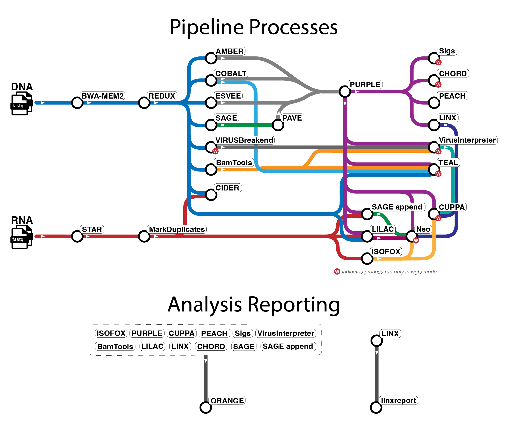

<h1>
  <picture>
    <source media="(prefers-color-scheme: dark)" srcset="docs/images/nf-core-oncoanalyser_logo_dark.png">
    
  </picture>
</h1>

> [!IMPORTANT]
> **This is `oncoanalyser-pb`, a Biocentric fork of [nf-core/oncoanalyser](https://github.com/nf-core/oncoanalyser) `2.3.0`** that adds an opt-in GPU-accelerated DNA alignment path via [NVIDIA Parabricks](https://www.nvidia.com/en-us/clara/genomics/) `4.0.0`.
> The CPU BWA-MEM2 path remains the default and is unchanged. Switch with `--aligner parabricks` plus a hardware profile (`p40_single`, `v100_multi`, `blackwell`).
> See [GPU acceleration with Parabricks](#gpu-acceleration-with-parabricks) below.

[](https://github.com/nf-core/oncoanalyser/actions/workflows/nf-test.yml)
[](https://github.com/nf-core/oncoanalyser/actions/workflows/linting.yml)
[](https://nf-co.re/oncoanalyser/results)
[](https://www.nf-test.com)
[](https://doi.org/10.5281/zenodo.15189386)

[](https://www.nextflow.io/)
[](https://github.com/nf-core/tools/releases/tag/3.5.1)
[](https://docs.conda.io/en/latest/)
[](https://www.docker.com/)
[](https://sylabs.io/docs/)

[](https://cloud.seqera.io/launch?pipeline=https://github.com/nf-core/oncoanalyser)
[](https://github.com/codespaces/new/nf-core/oncoanalyser)

[](https://nfcore.slack.com/channels/oncoanalyser)
[](https://bsky.app/profile/nf-co.re)
[](https://mstdn.science/@nf_core)
[](https://www.youtube.com/c/nf-core)

## Introduction

**nf-core/oncoanalyser** is a Nextflow pipeline for the comprehensive analysis of cancer DNA and RNA sequencing data
using the [WiGiTS](https://github.com/hartwigmedical/hmftools) toolkit from the Hartwig Medical Foundation. The pipeline
supports a wide range of experimental setups:

- FASTQ, BAM, and / or CRAM input files
- WGS (whole genome sequencing), WTS (whole transcriptome sequencing), and targeted / panel sequencing<sup>1</sup>
- Paired tumor / normal and tumor-only samples, and support for donor samples for further normal subtraction
- Purity estimate for longitudinal samples using genomic features of the primary sample from the same patient<sup>2</sup>
- UMI (unique molecular identifier) processing supported for DNA sequencing data
- Most GRCh37 and GRCh38 reference genome builds

<sub><sup>1</sup> built-in support for the [TSO500
panel](https://www.illumina.com/products/by-type/clinical-research-products/trusight-oncology-500.html) with other
panels and exomes requiring [creation of custom panel reference
data](https://nf-co.re/oncoanalyser/usage#custom-panels)</sub>
<br />
<sub><sup>2</sup> for example a primary WGS tissue biospy and longitudinal low-pass WGS ccfDNA sample taken from the
same patient</sub>

## Pipeline overview

<p align="center"></p>

The pipeline mainly uses tools from [WiGiTS](https://github.com/hartwigmedical/hmftools), as well as some other external
tools. There are [several workflows available](https://nf-co.re/oncoanalyser/usage#introduction) in `oncoanalyser` and
the tool information below primarily relates to the `wgts` and `targeted` analysis modes.

> [!NOTE]
> Due to the limitations of panel data, certain tools (indicated with `*` below) do not run in `targeted` mode.

- Read alignment: [BWA-MEM2](https://github.com/bwa-mem2/bwa-mem2) (DNA, default) or [NVIDIA Parabricks `fq2bam`](#gpu-acceleration-with-parabricks) (DNA, GPU, opt-in), [STAR](https://github.com/alexdobin/STAR) (RNA)
- Read post-processing: [REDUX](https://github.com/hartwigmedical/hmftools/tree/master/redux) (DNA), [Picard MarkDuplicates](https://gatk.broadinstitute.org/hc/en-us/articles/360037052812-MarkDuplicates-Picard) (RNA)
- SNV, MNV, INDEL calling: [SAGE](https://github.com/hartwigmedical/hmftools/tree/master/sage), [PAVE](https://github.com/hartwigmedical/hmftools/tree/master/pave)
- SV calling: [ESVEE](https://github.com/hartwigmedical/hmftools/tree/master/esvee)
- CNV calling: [AMBER](https://github.com/hartwigmedical/hmftools/tree/master/amber), [COBALT](https://github.com/hartwigmedical/hmftools/tree/master/cobalt), [PURPLE](https://github.com/hartwigmedical/hmftools/tree/master/purple)
- SV and driver event interpretation: [LINX](https://github.com/hartwigmedical/hmftools/tree/master/linx)
- RNA transcript analysis: [ISOFOX](https://github.com/hartwigmedical/hmftools/tree/master/isofox)
- Oncoviral detection: [VIRUSbreakend](https://github.com/PapenfussLab/gridss)\*, [VirusInterpreter](https://github.com/hartwigmedical/hmftools/tree/master/virus-interpreter)\*
- Telomere characterisation: [TEAL](https://github.com/hartwigmedical/hmftools/tree/master/teal)\*
- Immune analysis: [LILAC](https://github.com/hartwigmedical/hmftools/tree/master/lilac), [CIDER](https://github.com/hartwigmedical/hmftools/tree/master/cider), [NEO](https://github.com/hartwigmedical/hmftools/tree/master/neo)\*
- Mutational signature fitting: [SIGS](https://github.com/hartwigmedical/hmftools/tree/master/sigs)\*
- HRD prediction: [CHORD](https://github.com/hartwigmedical/hmftools/tree/master/chord)\*
- Tissue of origin prediction: [CUPPA](https://github.com/hartwigmedical/hmftools/tree/master/cuppa)\*
- Pharmacogenomics: [PEACH](https://github.com/hartwigmedical/hmftools/tree/master/peach)
- Summary report: [ORANGE](https://github.com/hartwigmedical/hmftools/tree/master/orange), [linxreport](https://github.com/umccr/linxreport)

For the `purity_estimate` mode, several of the above tools are run with adjusted configuration in addition to the following.

- Tumor fraction estimation: [WISP](https://github.com/hartwigmedical/hmftools/tree/master/wisp)

## GPU acceleration with Parabricks

This fork adds an opt-in GPU-accelerated DNA alignment path using
[NVIDIA Parabricks](https://docs.nvidia.com/clara/parabricks/4.0.0/) `4.0.0`. It replaces the CPU
BWA-MEM2 step with `pbrun fq2bam` while leaving everything downstream — REDUX, SAGE, PURPLE, LINX,
the rest of the WiGiTS chain — untouched. The pipeline still produces oncoanalyser outputs
identical in structure to the BWA-MEM2 path.

The CPU BWA-MEM2 path remains the default. To activate the GPU path, set `--aligner parabricks`
plus a hardware profile, as shown below.

### Why this design

- **Alignment-only on GPU; dedup is REDUX's job.** `fq2bam` runs with `--no-markdups`. Duplicate
  marking is left to [REDUX](https://github.com/hartwigmedical/hmftools/tree/master/redux),
  whose dedup and (optional) UMI consensus logic is tuned for SAGE's somatic error model.
- **`samtools fixmate` post-process to add mate CIGAR (MC) tags.** Parabricks 4.0.0's GPU BWA
  implementation does not emit MC tags — even with MarkDuplicates enabled — and REDUX rejects
  reads without MC. The Parabricks module therefore chains `samtools sort -n → samtools fixmate
  -m → samtools sort` after `fq2bam` to compute MC (and MS) tags before handing the BAM
  downstream. The Parabricks container bundles samtools, so this stays in one container. The
  three-stage sort/fixmate/sort costs roughly an extra 10–20% of fq2bam wall-time on real WGS;
  it's a one-shot fix for an upstream limitation we'd otherwise hit forever.
- **VCFs are not handed over.** Oncoanalyser calls somatic variants with SAGE (not Mutect2 or
  DeepVariant). The integration point is therefore the BAM, not the VCF.
- **Reference is the HMF bundle.** The same FASTA powers Parabricks alignment and all downstream
  hmftools. HMF ships a BWA-MEM2 index but not a classic BWA index, so the pipeline builds a
  classic BWA index from the FASTA on first run and caches it; alternatively you can supply
  `--ref_data_genome_bwa_index` pointing to a prebuilt directory or `.tar.gz`.
- **VRAM-tiered labels** (`gpu_16gb`, `gpu_24gb`, `gpu_32gb`) keep module code portable across
  GPU generations; concrete device count and concurrency live in the per-hardware profiles.

### Hardware requirements

Parabricks `4.0.0` officially supports Volta and newer (V100, T4, A100, …). The Pascal P40
(24 GB) is not on the official list but is **verified working** in this fork — the chr21
synthetic test dataset has been run end-to-end through `fq2bam → samtools fixmate → REDUX →
SAGE → AMBER → COBALT → PURPLE → LINX` on a single P40, GRCh38_hmf reference. Consumer Pascal
cards (e.g. GTX 1080 Ti) are not supported. Blackwell consumer 16 GB cards are usable for
development but tighter for high-coverage WGS — start with the P40 / V100 path.

| Profile        | Target hardware                                | fq2bam concurrency      |
|----------------|------------------------------------------------|-------------------------|
| `p40_single`   | Single NVIDIA Tesla P40 (Pascal, 24 GB)        | one sample at a time    |
| `v100_multi`   | Multi-V100 node                                | one sample, multi-GPU   |
| `blackwell`    | Single Blackwell consumer GPU (16 GB)          | one sample at a time    |

CPU steps (REDUX, SAGE, PURPLE, …) keep running in parallel for other samples while a GPU job is
in flight, so single-GPU throughput is governed by `fq2bam` runtime, not by serial blocking.

### Container runtime

Only Docker (with the [NVIDIA Container Toolkit](https://docs.nvidia.com/datacenter/cloud-native/container-toolkit/install-guide.html))
and Singularity / Apptainer (`--nv`) are supported. The Parabricks module pins the digest of
`nvcr.io/nvidia/clara/clara-parabricks:4.0.0-1`. Conda / Mamba profiles cannot be used with the
GPU path and the module errors out cleanly if combined.

### Quick start (P40)

```bash
nextflow run Biocentric/oncoanalyser-pb \
  -profile docker,gpu,p40_single \
  -revision main \
  --mode wgts \
  --genome GRCh37_hmf \
  --aligner parabricks \
  --input samplesheet.csv \
  --outdir output/
```

`-profile gpu` enables `--gpus all` for Docker (or `--nv` for Singularity / Apptainer).
`-profile p40_single` pins `params.aligner = parabricks` and serializes `fq2bam` invocations to
one at a time on the single P40, while letting CPU-bound downstream steps run in parallel.

For multi-V100 nodes, swap `p40_single` for `v100_multi`. For a Blackwell test box, use
`blackwell`.

### Switching between CPU and GPU paths

`--aligner` is the only knob that needs to change. With `bwa-mem2` (default) the pipeline behaves
exactly like upstream nf-core/oncoanalyser 2.3.0; with `parabricks` it routes DNA FASTQs through
`fq2bam` instead. You can mix samplesheets that start from FASTQ (aligner runs) with samplesheets
that start from BAM (aligner is skipped, BAMs feed straight into REDUX) — the `aligner` switch
only governs FASTQ inputs.

### Reference data

| Genome attribute | Source                                      |
|------------------|---------------------------------------------|
| `fasta` / `fai` / `dict` | HMF bundle (`GRCh37_hmf` or `GRCh38_hmf`) |
| `bwamem2_index`          | HMF bundle (used by the CPU path)         |
| `bwa_index` (classic)    | Built from `fasta` on first run, or supply `--ref_data_genome_bwa_index` (directory or `.tar.gz`) |

GRCh37 is the default for testing in this fork; GRCh38 is supported by changing
`--genome GRCh38_hmf`.

### Limitations / known follow-ups

- **Validated on the upstream chr21 synthetic test dataset (DNA-only) on a single P40.**
  Production-scale somatic WGS validation against a CPU-path baseline is still pending —
  output equivalence between `--aligner bwa-mem2` and `--aligner parabricks` has not been
  formally checked.
- The upstream `test` profile bundles RNA samples that exercise STAR, which has an unrelated
  thread-cleanup hang on small input. For now, run the Parabricks DNA path with
  `--processes_exclude isofox` and a DNA-only samplesheet (filter rows where
  `sequence_type == "dna"`).
- The upstream `test` profile sets `process.resourceLimits` to `cpus: 4, memory: 30.GB,
  time: 1.h`, which is too tight for full reference prep. Run with a small `-c` override that
  raises those caps to match the workstation (see `local.config` example below).
- Multi-lane samples currently invoke `fq2bam` once per lane (matches the BWA-MEM2 channel
  shape) and merge in REDUX downstream. Collapsing into a single `fq2bam` call per sample with
  multiple `--in-fq` entries is a planned optimization.
- A dedicated `test_parabricks` profile is not yet wired.
- UMI processing on the Parabricks path has not been validated. Set `redux_umi_enabled = true`
  with caution.

#### Example `local.config` for the test profile

```nextflow
process {
    resourceLimits = [
        cpus: 16,
        memory: '128.GB',
        time: '12.h'
    ]
}
```

Pass with `-c local.config`.

## Usage

> [!NOTE]
> If you are new to Nextflow and nf-core, please refer to [this page](https://nf-co.re/docs/usage/installation) on how to set-up Nextflow. Make sure to [test your setup](https://nf-co.re/docs/usage/introduction#how-to-run-a-pipeline) with `-profile test` before running the workflow on actual data.

Create a samplesheet with your inputs (WGS/WTS BAMs in this example):

```csv
group_id,subject_id,sample_id,sample_type,sequence_type,filetype,filepath
PATIENT1_WGTS,PATIENT1,PATIENT1-N,normal,dna,bam,/path/to/PATIENT1-N.dna.bam
PATIENT1_WGTS,PATIENT1,PATIENT1-T,tumor,dna,bam,/path/to/PATIENT1-T.dna.bam
PATIENT1_WGTS,PATIENT1,PATIENT1-T-RNA,tumor,rna,bam,/path/to/PATIENT1-T.rna.bam
```

Launch `oncoanalyser`:

```bash
nextflow run nf-core/oncoanalyser \
  -profile <docker/singularity/.../institute> \
  -revision 2.3.0 \
  --mode <wgts/targeted> \
  --genome <GRCh37_hmf/GRCh38_hmf> \
  --input samplesheet.csv \
  --outdir output/
```

> [!WARNING]
> Please provide pipeline parameters via the CLI or Nextflow `-params-file` option. Custom config files including those provided by the `-c` Nextflow option can be used to provide any configuration _**except for parameters**_; see [docs](https://nf-co.re/docs/usage/getting_started/configuration#custom-configuration-files).

For more details and further functionality, please refer to the [usage documentation](https://nf-co.re/oncoanalyser/usage) and the [parameter documentation](https://nf-co.re/oncoanalyser/parameters).

## Pipeline output

To see the results of an example test run with a full size dataset refer to the [results](https://nf-co.re/oncoanalyser/results) tab on the nf-core website pipeline page.
For more details about the output files and reports, please refer to the
[output documentation](https://nf-co.re/oncoanalyser/output).

## Version information

### Extended support

As `oncoanalyser` is used in clinical settings and subject to accreditation standards in some instances, there is a need
for long-term stability and reliability for feature releases in order to meet operational requirements. This is
accomplished through long-term support of several nominated feature releases, which all receive bug fixes and security
fixes during the period of extended support.

Each release that is given extended support is allocated a separate long-lived git branch with the 'stable' prefix, e.g.
`stable/1.2.x`, `stable/1.5.x`. Feature development otherwise occurs on the `dev` branch with stable releases pushed to
`master`.

Versions nominated to have current long-term support:

- TBD

## Known issues

Please refer to [this page](https://github.com/nf-core/oncoanalyser/issues/177) for details regarding any known issues.

## Credits

### Parabricks fork (`oncoanalyser-pb`)

The Parabricks GPU alignment integration in this fork is maintained by **Sander Bervoets**
([Biocentric](https://www.biocentric.nl)).

### Upstream `oncoanalyser`

The `oncoanalyser` pipeline was written and is maintained by Stephen Watts ([@scwatts](https://github.com/scwatts)) from
the [Genomics Platform
Group](https://mdhs.unimelb.edu.au/centre-for-cancer-research/our-research/genomics-platform-group) at the [University
of Melbourne Centre for Cancer Research](https://mdhs.unimelb.edu.au/centre-for-cancer-research).

We thank the following organisations and people for their extensive assistance in the development of this pipeline,
listed in alphabetical order:

- [Hartwig Medical Foundation
  Australia](https://www.hartwigmedicalfoundation.nl/en/partnerships/hartwig-medical-foundation-australia/)
- Oliver Hofmann

## Contributions and Support

If you would like to contribute to this pipeline, please see the [contributing guidelines](.github/CONTRIBUTING.md).

For further information or help, don't hesitate to get in touch on the [Slack `#oncoanalyser`
channel](https://nfcore.slack.com/channels/oncoanalyser) (you can join with [this invite](https://nf-co.re/join/slack)).

## Citations

You can cite the `oncoanalyser` Zenodo record for a specific version using the following DOI:
[10.5281/zenodo.15189386](https://doi.org/10.5281/zenodo.15189386)

An extensive list of references for the tools used by the pipeline can be found in the [`CITATIONS.md`](CITATIONS.md)
file.

You can cite the `nf-core` publication as follows:

> **The nf-core framework for community-curated bioinformatics pipelines.**
>
> Philip Ewels, Alexander Peltzer, Sven Fillinger, Harshil Patel, Johannes Alneberg, Andreas Wilm, Maxime Ulysse Garcia,
> Paolo Di Tommaso & Sven Nahnsen.
>
> _Nat Biotechnol._ 2020 Feb 13. doi: [10.1038/s41587-020-0439-x](https://dx.doi.org/10.1038/s41587-020-0439-x).
